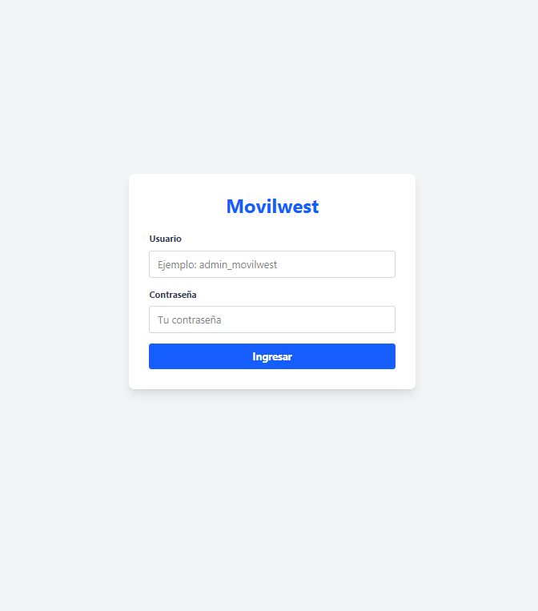
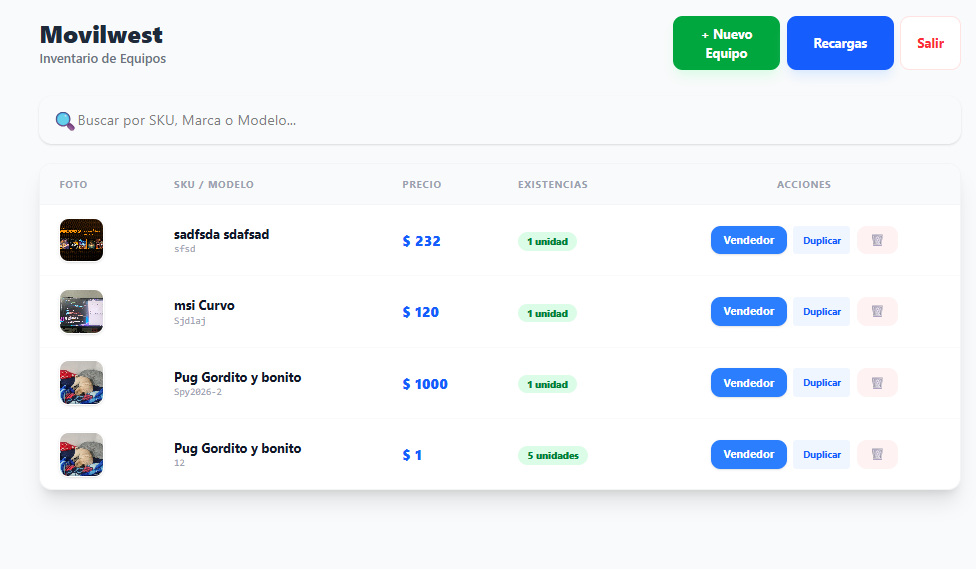
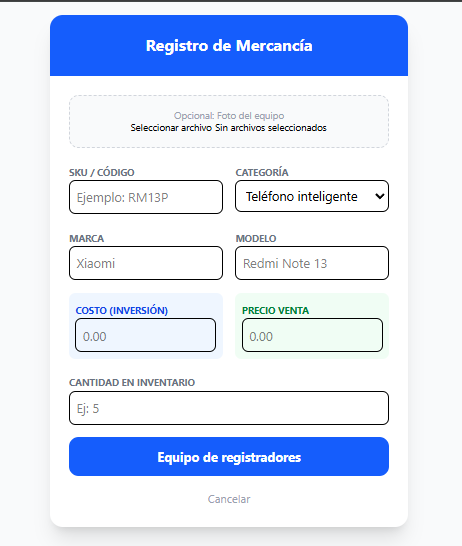
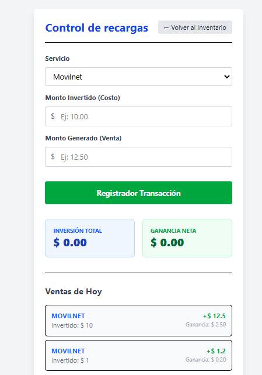
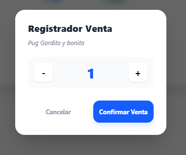

# 📱 Movilwest App

Plataforma de gestión para inventario de equipos, ventas y control de recargas, construida con **Flask + React + PostgreSQL** y orquestada con **Docker Compose**.

<p align="left">
  
  
  
  
</p>

## ✨ Resumen rápido
- Inventario con búsqueda en tiempo real.
- Registro de productos con foto y soporte de duplicación.
- Venta de productos con modal de cantidad y actualización de stock.
- Control de recargas con historial del día y métricas financieras.
- Autenticación por JWT y rutas protegidas.

## 🧱 Arquitectura
El backend sigue una estructura por capas:
- `adapters`: rutas HTTP y middleware.
- `use_case`: reglas de negocio.
- `infrastructure`: DB, modelos y repositorios.

El frontend está dividido por componentes de negocio:
- `Login`, `Inventario`, `AgregarProducto`, `Recargas`.

## 🚀 Levantar el proyecto (Docker)
```bash
docker compose up -d --build
```

Servicios disponibles:
- Frontend: http://localhost:5173
- Backend API: http://localhost:5000
- pgAdmin: http://localhost:5050
- PostgreSQL: localhost:5432

## 🔐 Variables de entorno
Se usan `.env` en raíz y `frontend/.env` para el cliente.

Ejemplo principal (raíz):
```env
POSTGRES_DB=
POSTGRES_USER=
POSTGRES_PASSWORD=
DATABASE_URL=
PGADMIN_DEFAULT_EMAIL=
PGADMIN_DEFAULT_PASSWORD=
```

## 🧭 Endpoints principales
- `POST /api/usuarios/login`
- `POST /api/usuarios/registro`
- `GET /api/productos/`
- `POST /api/productos/nuevo`
- `POST /api/productos/vender/:id`
- `DELETE /api/productos/:id`
- `POST /api/recargas/nueva`
- `GET /api/recargas/hoy`
- `GET /api/status`

## 🗂️ Documentación técnica completa
Consulta el detalle técnico en:
- [DOCUMENTACION_PROYECTO.md](DOCUMENTACION_PROYECTO.md)

## ✅ Estado actual
Proyecto funcional en entorno Docker con flujo completo:
- login,
- inventario,
- ventas,
- duplicación de producto,
- control de recargas,
- visualización de imágenes y base de datos.

## 🖼️ Capturas de pantalla

> Reemplaza las imágenes de ejemplo colocando tus archivos en `docs/screenshots/`.

### Login


### Inventario


### Registro de Producto


### Recargas


### Venta (Modal)

